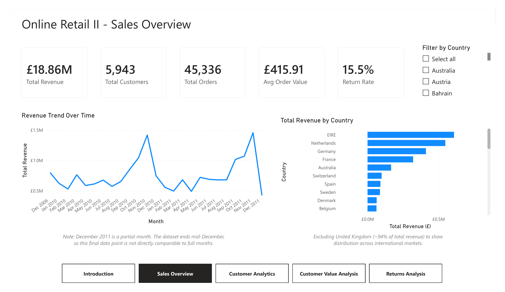
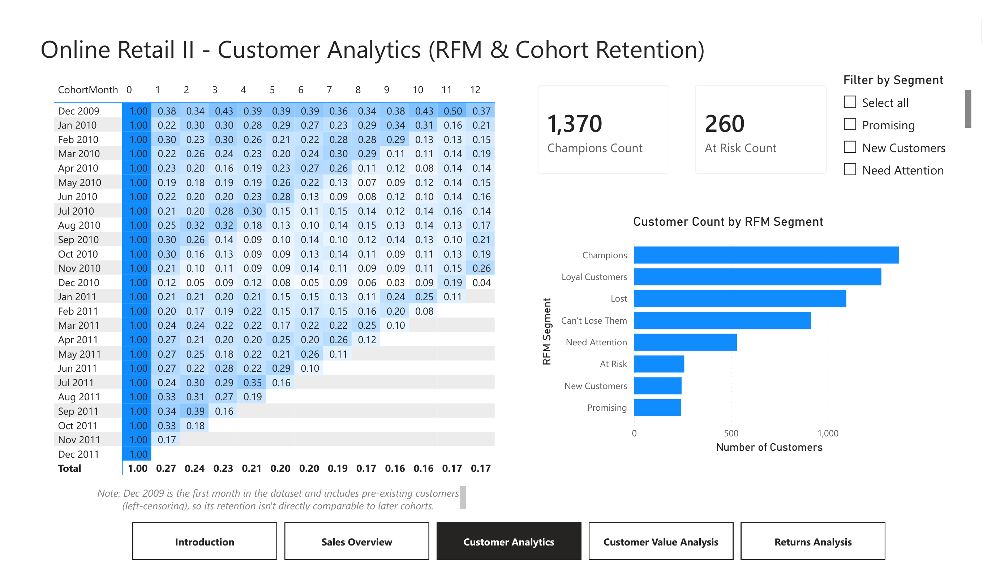
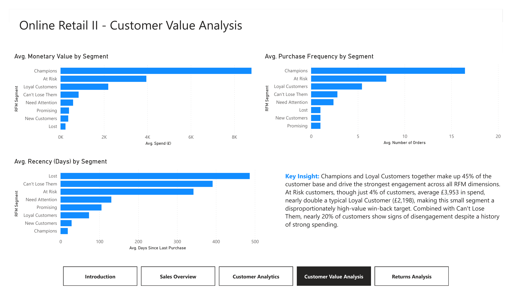
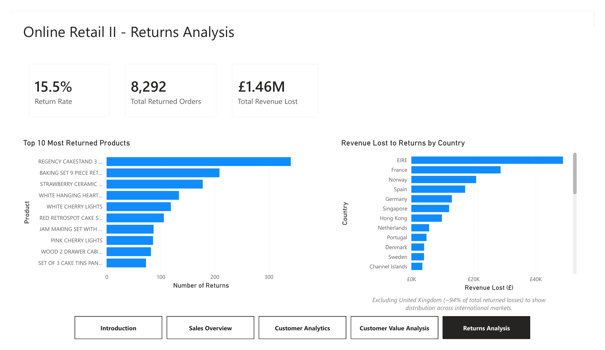

# Online Retail II — Power BI Analytics Dashboard

A 5-page Power BI dashboard analyzing two years (Dec 2009–Dec 2011) of transactional 
data from a UK-based online gift wholesaler. The project covers sales performance, 
customer segmentation (RFM analysis), retention behavior (cohort analysis), and 
return patterns. This dashboard was built to demonstrate data cleaning, DAX modeling, and dashboard 
design skills using a real-world, messy retail dataset.

**Dataset:** [Online Retail II](https://www.kaggle.com/datasets/mashlyn/online-retail-ii-uci) 
(UCI Machine Learning Repository / Kaggle)

**Tools:** Power BI Desktop, Power Query (M), DAX

## Data Cleaning (Power Query)

- Removed 34,335 exact duplicate rows (3.2% of data)
- Flagged returns (`IsReturn`) based on Invoice numbers starting with "C"
- Flagged non-product line items (`IsProductCode`) to exclude postage, bank charges, 
  discounts, and similar administrative entries from product-level analysis
- Identified via the Kaggle dataset documentation that `Price` is denominated in GBP (£), not USD, so adjusted the currency formatting across the model accordingly
- Documented known data issues: ~23% of rows have null Customer IDs (retained for 
  revenue totals, excluded from RFM/cohort analysis), and ~817 rows have non-standard 
  country labels (e.g. "Unspecified," "European Community")

## Methodology

**Data Model:** Star schema with a dedicated Calendar table (CALENDARAUTO, marked 
as Date Table) related to the fact table on a date-only key, enabling correct 
time-intelligence behavior.

**RFM Segmentation:** Customers scored 1–5 on Recency, Frequency, and Monetary 
value (quintile ranking via RANKX), combined into 8 segments (Champions, Loyal 
Customers, At Risk, Can't Lose Them, Lost, Need Attention, Promising, New Customers) 
using a priority-ordered SWITCH.

**Cohort Retention:** Customers grouped by first-purchase month; retention tracked 
by months since first purchase, relative to each cohort's starting size.

**Returns Analysis:** Return invoices identified by Invoice numbers prefixed "C," 
isolated from inventory write-offs/damage entries (which are unflagged and 
zero-revenue, and were excluded from this analysis as a separate, uninvestigated 
cost category).

## Key Findings

- **Revenue grew steadily through 2010–2011**, with sharp November spikes from 
  wholesale customers stocking up ahead of the holiday season.
- **The Dec 2009 cohort is anomalous**, at 1,046 customers, it's 4–13x larger 
  than any other cohort, indicating left-censoring (it captures pre-existing 
  customers whose true acquisition date predates the dataset). Its retention 
  figures are not comparable to later cohorts.
- **Customer value is concentrated**: Champions and Loyal Customers make up 45% 
  of customers and drive the strongest engagement across all RFM dimensions.
- **At Risk customers (4% of the base) average £3,953 in spend**, nearly double 
  a typical Loyal Customer (£2,198), representing a small, high-value win-back 
  opportunity rather than a lost cause.
- **Return rate is 15.5%**, with returns concentrated in a small set of products 
  (e.g. Regency Cakestand, Baking Set 9 Piece), a candidate list for quality or 
  fulfillment review.
- All monetary figures are in **GBP (£)**.

## Dashboard

The dashboard includes an in-app intro/navigation page describing each of the 4 
analysis pages. Full interactive file: `OnlineRetailDashboard.pbix`

